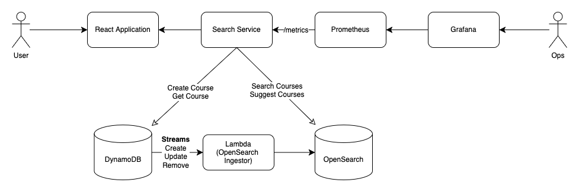

# Search Service

A simple search and text-suggestion service built on OpenSearch with a NextJS frontend, prometheus and grafana for observability. 

The plan is to extend this service, add OpenSearch cluster on AWS as data store and ingest data from DynamoDB into OpenSearch via DynamoDB streams.

The compute will be deployed on ECS with the react application deployed on S3. 

# Architecture



# Project Structure


```
├── README.md
├── assets
├── docker-compose.yaml
├── frontend
├── grafana
├── ingestion-service
├── prometheus
├── scripts
├── search-service
└── volume

9 directories, 2 files
~/code/search-service (main) $ tree -L 2
.
├── assets                                    # Architecture Diagrams
│   ├── SearchServiceArchitecture.drawio
│   └── SearchServiceArchitecture.png         
├── docker-compose.yaml                       # Local development docker compose
├── frontend
│   └── search-app                            # NextJS frontned app
├── grafana                                   # Grafana Configuration
├── ingestion-service                   
│   ├── handler.py                            # Ingestion service lambda
│   └── requirements.txt                      # Ingestion service dependencies
├── prometheus                                # Prometheus Configuration
├── scripts                                   # Local development setup scripts             
└── search-service
    ├── Dockerfile                    
    ├── clients
    ├── controllers
    ├── dao
    ├── go.mod
    ├── go.sum
    ├── handlers
    ├── main.go
    ├── middleware
    ├── models
    └── utils
```

# Usage 

## Requirements

* Go installed - v1.24
* Docker installed - v20.10.10
* Docker compose installed - v1.29.2

``` bash
pip install aws-local
```

## Build Lambda

``` bash
cd lambda
python3 -m venv env
source env/bin/activate
mkdir package
pip install -r requirements.txt --target package 
deactivate
```

## Launch Service

``` bash
# Launch services
docker-compose up -d --build

# Check AWS logs
docker logs localstack-main -f 
```

## Create Opensearch Index and AWS resources

Once docker-compose has built and deployed, run the following scripts. 

``` bash
INDEX_NAME=courses

# Create OpenSearch Index
./scripts/create-os-index.sh ${INDEX_NAME}

# Build AWS Resources
./scripts/localstack-setup.sh ${INDEX_NAME}
``` 

## Build Grafana Dashboard

Metrics included 

```
P99 Latency
Total Requests
Requests per interval
Error rate
```

1. Navigate to `http:localhost:3000`
2. Login using username: `admin`, password: `admin` 
3. Add Prometheus as a data source: `http:localhost:9090`
4. Import dashboard from JSON
5. Copy contents of grafana.json

## Hit the service

Navigate to `localhost:3001` and use the service

Or 

This script will run and hit the service 2000 times, you can see the metrics being imported into grafana.

``` bash
./scripts/test-service.sh
```

## Clean up

``` bash 
docker-compose down
```
